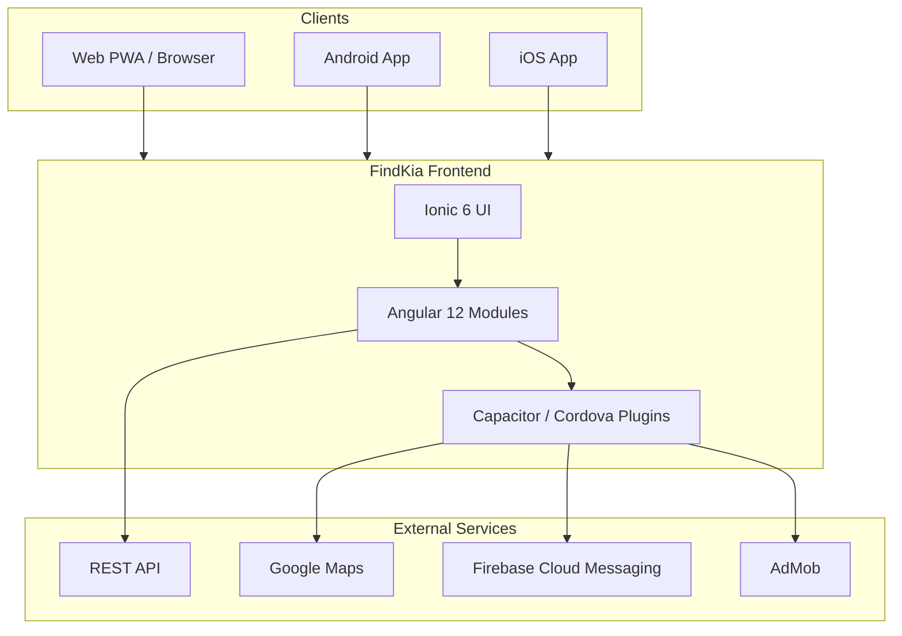

# FindKia

**FindKia** is a cross-platform app, digital platform developed by Hudaz Tech and officially launched in 2022. The platform is designed to bridge the gap between the general public and a wide range of service providers offering services and products across multiple categories. These categories include marriage halls, restaurants, catering services, vehicles such as cars and pickups, and various other commercial and household services.

**In addition**, Findkia provides a convenient solution for connecting users with skilled manpower and human resources from different professions, including electricians, plumbers, mechanics, technicians, and other service specialists.

- The platform enables service providers to register online through the Findkia mobile application using their registered mobile number along with National Identity Card (NIC) verification. With a highly economical registration model, businesses and individuals can market their services by creating their own dedicated mobile application pages. Service providers can easily upload their business details, service descriptions, pricing information, images, and videos to showcase their offerings professionally.

- Once the registration and verification process is completed and approved, the service provider’s profile becomes publicly visible on the Findkia platform. Registered providers can further promote their business by sharing their personalized page links through integrated social media sharing options available within the Findkia application. Users receiving these links can directly access the provider’s page through either the Findkia mobile application or the web platform.

- For customers and the general public, Findkia offers a convenient and user-friendly experience to search for required services, vehicles, products, or manpower from the comfort of their homes. Users can browse detailed provider profiles, view product and service rates, examine photos and videos, access location information, and directly contact service providers using the contact details available on the platform.

- Findkia supports multiple platforms, including Android applications, iOS applications, and web browsers, ensuring accessibility and convenience for a broad range of users across different devices.


## Screenshots

| Services Home Screen | Services Home Screen (Urdu) |
|-----------|----------------|
|  |  |
| Historical Analytics | Smart City Monitoring |
|  |  |
| AI Model Monitoring |System Architecture |
|  |  |


One codebase ships to **web**, **Android**, and **iOS** using **Ionic 6**, **Angular 12**, and **Capacitor 4**, backed by a REST API and JWT authentication.

| | |
|---|---|
| **Product** | [findkia.com](https://findkia.com) |
| **Stack** | Ionic 6 · Angular 12 · Capacitor 4 |
| **Node.js** | 18.x (see `.nvmrc`) |
| **Languages** | English · Urdu |

---

## Project summary

FindKia connects **customers**, **service providers**, and **administrators** in a single application:

| Persona | What they do in the app |
|---------|-------------------------|
| **Customer / guest** | Browse services by role and city, search with live location, view maps, add items to basket, checkout, manage bookings, favourites, and profile |
| **Service provider (SP)** | Manage business profile, menus, images/videos, subscription packages, orders, payments, online/offline status, and live location (drivers) |
| **Administrator** | Dashboard analytics, user & SP management, approvals, payment requests, image/video moderation, maps, addresses, and support chat |

The app is **multi-role**: the home screen and search flows adapt based on the logged-in role (e.g. hotels, cars, activities, wedding halls, transport). Permissions are enforced server-side and reflected in the UI via JWT claims and role maps.

### High-level architecture



### Request flow (simplified)

1. User authenticates → JWT stored via Ionic Storage  
2. `HttpInterceptor` attaches token to API calls (`environment.siteUrl`)  
3. Role-based guards route users to customer, SP, or admin areas  
4. Push notifications, maps, camera, and file plugins run through Capacitor/Cordova on native builds  

---

## Features

### Customer & booking

- **Home & discovery** — role-based service grid, promotional banners, recommended listings  
- **Search** — city/area filters, date ranges, live GPS search with radius, grid/list/map results  
- **Detail & basket** — service menus, scheduling, item modal, checkout  
- **Verticals** — hotels, rent-a-car, trip activities, wedding halls  
- **Account** — register, login, SMS verification, password reset, edit profile, messages  

### Service provider

- **Dashboard** — subscription status, online/offline toggle, account summary  
- **Business** — profile, menus, menu images, SP images, video upload  
- **Commerce** — packages, payment flow, payment status, orders  
- **Location** — live location sharing for eligible roles (e.g. drivers)  

### Administration

- **Dashboard** — KPI cards and charts  
- **Users & SPs** — CRUD, approvals, datatable filters, date-range search  
- **Moderation** — image requests, video requests, SP comments  
- **Operations** — payment requests, SP packages, Google map tools, map addresses, admin chat  

### Platform

- **Maps** — Google Maps (web AGM), native Google Maps, TPL map variants  
- **i18n** — `@ngx-translate` (`src/assets/i18n/en.json`, `ur.json`)  
- **Notifications** — Firebase Cloud Messaging  
- **Deep links** — `findkia://` / `https://findkia.com` (Cordova deeplinks plugin)  
- **UI theme** — dark glassmorphism design system ([docs/DESIGN_SYSTEM.md](docs/DESIGN_SYSTEM.md))  

---

## Tech stack

| Layer | Technology |
|-------|------------|
| UI framework | Ionic 6 + Angular 12 |
| Native runtime | Capacitor 4 (+ Cordova plugins for legacy features) |
| Language | TypeScript 4.3 |
| Styling | SCSS, Ionic CSS variables, custom glass theme |
| State / storage | Ionic Storage, RxJS 6 |
| Backend | REST API (`environment.siteUrl`) |
| Authentication | JWT (`@auth0/angular-jwt`) |
| Maps | `@agm/core`, `@capacitor/google-maps`, ngx-google-places-autocomplete |
| Charts / tables | `@swimlane/ngx-charts`, `@swimlane/ngx-datatable` |
| Push / analytics | Firebase 7, `@angular/fire` |
| i18n | `@ngx-translate/core` |
| Testing | Karma + Jasmine |
| Hosting (web) | Firebase Hosting (`npm run deploy`) |

---

## Prerequisites

- **Node.js 18.x** (required — see `.nvmrc`)  
- **npm 8+**  
- **Ionic CLI** (optional; invoked via npm scripts)  
- **Android Studio** / **Xcode** — native builds  
- **Java JDK 11+** — Android  

### Install Node.js 18

**Windows (nvm-windows):**
```bash
nvm install 18
nvm use 18
```

**macOS / Linux (nvm):**
```bash
nvm install
nvm use
```

Verify:
```bash
node -v   # v18.x.x
npm -v    # 8.x or higher
```

---

## Getting started

### 1. Clone the repository

```bash
git clone <repository-url>
cd Connected.App.New
```

### 2. Install dependencies

```bash
npm install
```

> `postinstall` runs `scripts/setup-env.js`, which creates `environment.ts` and `environment.prod.ts` from `environment.example.ts` when missing.

### 3. Configure environment

Copy and edit environment files:

```bash
cp src/environments/environment.example.ts src/environments/environment.ts
cp src/environments/environment.example.ts src/environments/environment.prod.ts
```

| Variable | Description |
|----------|-------------|
| `siteUrl` | Backend API base URL (must end with `/api/`) |
| `mapKey` | Google Maps JavaScript API key |
| `mapKeyStatic` | Google Maps Static API key |
| `firebase` | Firebase project credentials (FCM, hosting) |
| `production` | `true` in `environment.prod.ts` for release builds |
| `versionCode` / `versionNumber` | App version shown in About screen |

> `environment.ts` and `environment.prod.ts` are **gitignored** — never commit API keys or secrets.

### 4. Run in the browser

```bash
npm start
# or
npm run serve
```

Open [http://localhost:8100](http://localhost:8100).

### 5. Production build

```bash
npm run build
```

Output: `www/`

---

## NPM scripts

| Command | Description |
|---------|-------------|
| `npm start` | Dev server (`ng serve` with OpenSSL legacy provider on Node 17+) |
| `npm run serve` | Ionic dev server |
| `npm run lab` | Ionic Lab — multi-platform preview |
| `npm run build` | Production build |
| `npm run build:dev` | Development build |
| `npm test` | Unit tests (Karma) |
| `npm run lint` | TSLint |
| `npm run deploy` | Deploy `www/` to Firebase Hosting |
| `npm run android` | Run on Android (Cordova) |
| `npm run ios` | Run on iOS simulator (Cordova) |

---

## Native mobile builds

### Capacitor (recommended)

```bash
npm run build
npx cap sync
npx cap open android   # or ios (macOS only)
```

Build and run from Android Studio or Xcode.

### Cordova (legacy scripts)

```bash
npm run android
npm run ios
```

---

## Project structure

```
Connected.App.New/
├── src/
│   ├── app/
│   │   ├── Admin/              # Admin dashboard, users, SP approvals, moderation, maps
│   │   ├── pages/              # Feature modules (lazy-loaded routes)
│   │   │   ├── main/           # Home / service discovery
│   │   │   ├── sp-search/      # Search, filters, results (grid/list/map)
│   │   │   ├── sp-detail/      # Service provider detail
│   │   │   ├── basket/         # Cart & checkout
│   │   │   ├── dashboard-sp/   # SP dashboard
│   │   │   ├── login/          # Auth flows
│   │   │   └── …               # Hotels, cars, activities, settings, etc.
│   │   ├── services/           # API & business logic
│   │   ├── shared/             # Components, guards, interceptors, global provider
│   │   └── model/              # TypeScript interfaces / models
│   ├── assets/
│   │   └── i18n/               # en.json, ur.json
│   ├── environments/           # App config (gitignored)
│   └── theme/
│       ├── variables.scss      # Design tokens, Ionic colors, dark mode
│       ├── glassmorphism.scss  # Glass cards, buttons, layout
│       ├── dark-global.scss    # Global dark theme overrides
│       ├── admin-pages.scss    # Admin datatables, modals
│       └── sp-results.scss     # Search result grid & list
├── docs/
│   └── DESIGN_SYSTEM.md        # UI guidelines & component patterns
├── scripts/
│   ├── run.js                  # OpenSSL legacy provider wrapper
│   └── setup-env.js            # Environment file bootstrap
├── .nvmrc                      # Node 18
├── .npmrc                      # legacy-peer-deps
└── capacitor.config.json
```

### Key routes (examples)

| Path | Module |
|------|--------|
| `/`, `/main` | Home & service discovery |
| `/spsearch` | Service provider search |
| `/sp-detail/:id` | SP detail page |
| `/basket` | Shopping basket |
| `/dashboard-sp` | SP dashboard |
| `/dashboard` | Admin dashboard |
| `/users`, `/sps` | Admin user & SP management |
| `/howto` | Video tutorials |
| `/privacypolicy` | Privacy policy |

Full route table: `src/app/app-routing.module.ts`

---

## UI & design system

The app uses a **dark-first glassmorphism** theme (indigo primary, cyan accent, Inter typography). Shared patterns:

- `glass-header` — frosted toolbars  
- `app-shell` + `app-shell-bg` — page background mesh  
- `glass-card` — cards, panels, modals  
- `btn-search` / `btn-glass` — primary and secondary actions  

See **[docs/DESIGN_SYSTEM.md](docs/DESIGN_SYSTEM.md)** for tokens, spacing, and component rules.

---

## Node.js 18 compatibility

This repo targets **Node.js 18**. Notable adjustments:

- Removed legacy `@ionic/app-scripts` (avoided `node-sass` failures)  
- Pinned packages for Angular 12 compatibility (`@auth0/angular-jwt@5.0.2`, `sass@1.54.9`, etc.)  
- `scripts/run.js` sets `--openssl-legacy-provider` on Node 17+ (Webpack / Angular 12)  
- `.npmrc` uses `legacy-peer-deps` for older peer trees  
- Browser-safe helpers replace Node `util` imports where needed  

---

## Troubleshooting

### `ERR_OSSL_EVP_UNSUPPORTED` on Node 18+

Use npm scripts (`npm start`, `npm run build`). They run through `scripts/run.js`.

### Clean reinstall

```bash
rm -rf node_modules package-lock.json
npm install
```

### Missing environment files

```bash
node scripts/setup-env.js
```

### Port in use

```bash
npx ionic serve --port 8200
```

---

## Deployment

### Firebase Hosting (web)

```bash
npm run build
npm run deploy
```

Requires Firebase CLI login and project configuration.

### Android release keystore (one-time)

```bash
keytool -genkey -v -keystore my-release-key.keystore -alias alias_name -keyalg RSA -keysize 2048 -validity 10000
```

---

## Documentation

| Document | Description |
|----------|-------------|
| [README.md](README.md) | This file — overview, setup, structure |
| [docs/DESIGN_SYSTEM.md](docs/DESIGN_SYSTEM.md) | Colors, typography, glass UI patterns |

---

## License

Private project. Contact the repository owner for licensing terms.

---

## Version

App version is defined in `src/environments/environment.prod.ts` (`versionCode`, `versionNumber`).  
Package version: see `package.json`.
